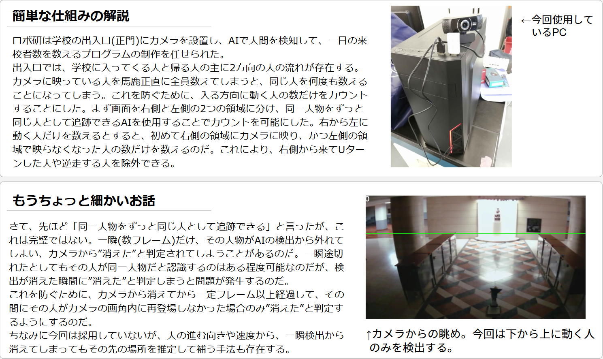

<h1>Yolov8を用いた通過する人間の検出ツール</h1>

カメラに写る人間のうち、設定した方向に通っていく人間のみをカウントできます。

細かいことはコードを読んでください。仕組みはわりとシンプルです。

人間を正しく検出する部分でかなり苦戦した記憶があります。

線画を抽出したものを重ねて輪郭をはっきりさせてみたりなど色々試行錯誤しましたが、結局既に優秀なモデル追加で学習を施すことでこの問題を解決しました。(他は全部没)

少しだけ詳しい説明は以下

カメラの設置場所

